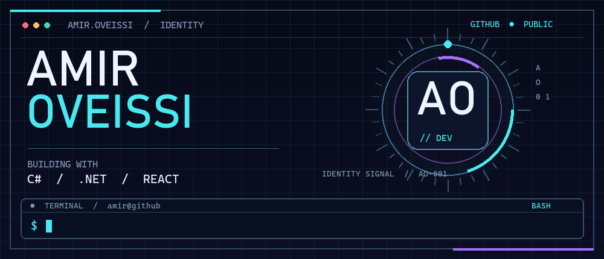
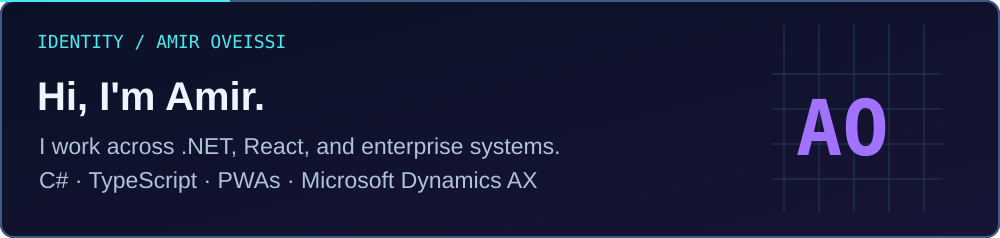
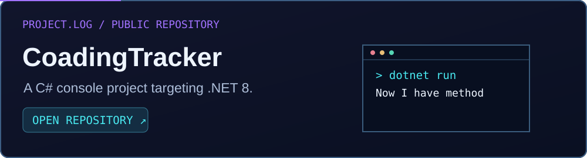
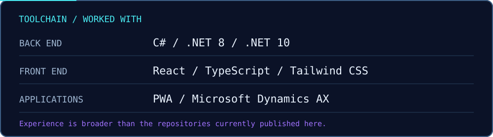

  

 

  <a href="https://github.com/AmirOveissi?tab=repositories"><b>Explore repositories</b></a>
  &nbsp;&nbsp;·&nbsp;&nbsp;
  <a href="https://github.com/AmirOveissi/CoadingTracker"><b>Public repository</b></a>
  &nbsp;&nbsp;·&nbsp;&nbsp;
  <a href="https://www.linkedin.com/in/amir-oveissi-261836192/"><b>LinkedIn</b></a>

 

 

 

 

### What I work with

**Back end:** C#, .NET 8, .NET 10  
**Front end:** React, TypeScript, Tailwind CSS  
**Applications & enterprise:** Progressive Web Apps (PWA), Microsoft Dynamics AX

 

  <code>amir@github:~$</code> keep building · <a href="https://github.com/AmirOveissi">GitHub</a> · <a href="https://www.linkedin.com/in/amir-oveissi-261836192/">LinkedIn</a>

